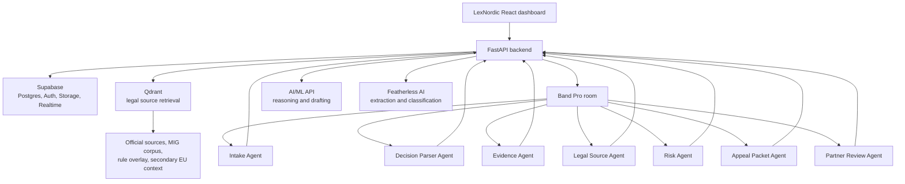

# Approved Stack

Purpose: lock the build architecture for LexNordic Migration Board.

Last updated: 2026-06-13

## Decision

Use this stack for the hackathon product:

```text
Frontend:        React + Vite + TypeScript
Backend API:     Python FastAPI
Matter backend:  Supabase Postgres + Auth + Storage + Realtime
Legal retrieval: Qdrant
Agent layer:     Band Pro + Band SDK remote agents
Model layer:     AI/ML API + Featherless AI
Parsing:         pypdf / pdfplumber / BeautifulSoup
Validation:      Pydantic
Config:          .env + ignored local YAML
```

## Architecture Map



## Responsibility Split

### Supabase

Supabase is the matter-system backend.

Use it for:

- user/operator accounts,
- matter records,
- uploaded document metadata,
- secure document storage,
- agent task state,
- Band room IDs,
- agent run logs,
- packet versions,
- review decisions,
- audit events,
- live dashboard updates through Realtime.

Do not use Supabase as the first-choice legal retrieval engine if Qdrant is available. Supabase stores matter state; Qdrant retrieves legal source chunks.

### Qdrant

Qdrant is the legal retrieval engine.

Use it for:

- semantic search over legal source chunks,
- hybrid dense/sparse retrieval,
- metadata filtering by source type, authority, date, topic, permit type, and risk flag,
- retrieving cited source packets for agents.

Qdrant answers: "Which legal source chunks are relevant?"

### FastAPI

FastAPI is the control API between UI, Supabase, Qdrant, Band agents, and model providers.

Use it for:

- upload orchestration,
- document parsing,
- RAG endpoints,
- model routing,
- agent tool endpoints,
- packet assembly,
- audit logging.

### Band Pro / Band SDK

Band is the coordination layer judges should see.

Use it for:

- matter rooms,
- agent handoffs,
- shared transcript,
- role-based collaboration,
- visible packet-quality gates.

Band answers: "Who is doing what, and how did the agents coordinate?"

### AI/ML API

AI/ML API is the premium reasoning and drafting provider.

Use it for:

- legal-source synthesis,
- risk reasoning,
- appeal packet drafting,
- partner-review checks,
- model fallback or comparison if useful.

### Featherless AI

Featherless is the open-model specialist provider.

Use it for:

- field extraction,
- document classification,
- source tagging,
- Swedish/English cleanup,
- cheap second-opinion checks,
- risk prechecks.

## Data Boundaries

Matter data:

```text
Supabase
```

Legal source chunks and retrieval metadata:

```text
Qdrant
```

Large/private local source files:

```text
Local disk, outside public repo
```

Agent coordination:

```text
Band
```

Model calls:

```text
AI/ML API and Featherless
```

## Supabase Tables

Implemented MVP schema:

- `matters`
- `matter_documents`
- `agent_runs`
- `evidence_items`
- `legal_source_refs`
- `packet_versions`
- `review_decisions`
- `matter_deadlines`
- `audit_events`

Security rules:

- Enable RLS on every exposed table.
- Do not expose service-role or secret keys to the browser.
- Use app metadata or relational role tables for authorization, not user-editable user metadata.
- Keep legal-source indexing jobs server-side.
- Store uploaded files in private buckets.

## FastAPI Endpoints

Implemented local endpoints:

```text
GET  /health
GET  /legal/collection
POST /legal/search
POST /legal/citation-bundle
GET  /permits/routes
GET  /permits/routes/{route_id}
POST /permits/match
GET  /matters/{matter_number}/workspace
POST /matters/{matter_number}/document-request
POST /matters/{matter_number}/documents
POST /matters/{matter_number}/agent-room/run-demo
POST /matters/{matter_number}/review/approve
```

## Build Status

1. React UI is now the Stitch-selected Evidence Readiness Workspace.
2. FastAPI exposes health, legal RAG, permit routes, and matter-workspace APIs.
3. Supabase schema, RLS, private Storage bucket, and fictional demo matter are applied.
4. Qdrant legal retrieval collection is seeded with official/rule/MIG source chunks.
5. Provider clients are configured through AI/ML API and Featherless.
6. The old Codex adapter scaffold has been replaced with Band SDK provider-backed runners.
7. The local demo flow runs from fictional decision readiness through upload, agent room, packet, and AI packet gate.

## Non-Goals For Hackathon MVP

- No real client data.
- No autonomous filing or submission.
- No final legal advice.
- No payment/billing setup without explicit approval.
- No public indexing of private secondary-source files.
- No production deployment without explicit approval.
